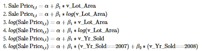
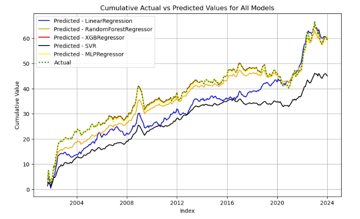

# About Me

**Lehigh University, Class of 2026**  
*College of Business – Finance and Business Analytics*

  

---

# Portfolio

## 📈 Stock Return Survival Analysis

  

This analysis uses the **Cox Proportional Hazards** model to evaluate financial signals. Hazard ratios (**exp(coef)**) indicate how each signal affects the risk of stock delisting:

- **Hazard ratio > 1** → Higher risk of being delisted (shorter survival)
- **Hazard ratio < 1** → Lower risk (positive survival)

> Example: **Total Accruals**  
> A ratio > 1 means higher accruals increase the chance of delisting or financial distress.

Significance is determined at **p < 0.1**.

---

## 📊 Regression Practice

This was an exercise in interpreting regression outputs. The model regressed **Lot Area** and **Year Sold** on **Sales Price**.

  

  

---

## 🤝 Team Project: [Stock Prediction Analysis](https://www.theasians.streamlit.app)

  

This project compares cumulative returns of signal-level portfolios using the **OpenAP library** and several ML models:

- Linear Regression  
- MLP Regressor  
- Random Forest  
- SVR (Support Vector Regressor)  
- XGBoost  

---

# Career Objectives

Aspiring finance and analytics professional pursuing a B.S. in Finance and Business Analytics at Lehigh University. I aim to leverage financial modeling, investment analysis, and data science to add value in **private equity, venture capital**, or **financial consulting**. Passionate about delivering data-driven insights and sustainable investment strategies on a global scale.

---

# Hobbies

🎵 Music Production  
🏋️‍♂️ Gym & Fitness  
🏀 NBA Fan – Lifelong supporter of the **Golden State Warriors**

---

# 📬 Contact

- **Email**: ngoclamnguyenpham@gmail.com  
- **Phone**: (484) 767-0534  
- **Location**: Bethlehem, PA
