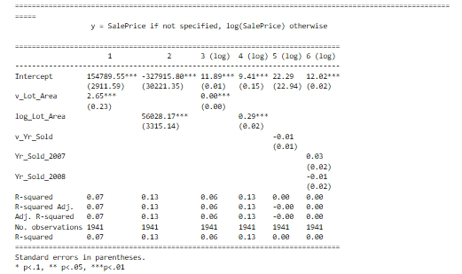

## About Me

**Lehigh University Class of 2026**

College of Business

Finance and Business Analytics

<!-- Upload your own photo and change the path -->

  

---

## Portfolio

<!-- You can link to other websites, PDFs in this repo, and other pages in this repo -->

_**Stock Return Survival Analysis**_

The following analysis presents the results from a **Cox Proportional Hazards** model. I categorize signals based on whether their hazard ratios (**exp(coef)**) are greater than or less than 1, indicating whether they are associated with **increased** hazard (higher risk) or positive survival (growth). p-values less than **0.1** indicate signals with statistically significant associations.

A hazard ratio (**exp(coef)**) greater than 1 suggests the signal increases the risk of being **delisted** (higher "death risk"), while a hazard ratio less than 1 suggests it reduces the risk ("still alive").

Ex: **Total Accruals**: A hazard ratio greater than 1 means that **higher accruals** are associated with an increased risk of being **delisted** or facing financial distress.

---

_**[Regression Practice]**_

This is my exercise file from when I learned about how to interpret regression. This code purpose was to do a regression on Lot Area, and Year Sold against the Sales Price of houses.
1. $\text{Sale Price}_{i,t} = \alpha + \beta_1 * \text{v\_Lot\_Area}$
2. $\text{Sale Price}_{i,t} = \alpha + \beta_1 * log(\text{v\_Lot\_Area})$
3. $log(\text{Sale Price}_{i,t}) = \alpha + \beta_1 * \text{v\_Lot\_Area}$
4. $log(\text{Sale Price}_{i,t}) = \alpha + \beta_1 * log(\text{v\_Lot\_Area})$
5. $log(\text{Sale Price}_{i,t}) = \alpha + \beta_1 * \text{v\_Yr\_Sold}$
6. $log(\text{Sale Price}_{i,t}) = \alpha + \beta_1 * (\text{v\_Yr\_Sold==2007})+ \beta_2 * (\text{v\_Yr\_Sold==2008})$

---

_**[Eventual team project](https://donbowen.github.io/teamproject/)**_

---

_**[Some personal project](/pdf/sample_presentation.pdf)**_

---

## Career Objectives

Write what you want. 

Sell yourself!

---

## Hobbies

Maybe include a little about these, especially if they are the kinds of things that work well in interviews.

---

Page template forked from <a href="https://github.com/evanca/quick-portfolio">evanca</a>

<!-- Remove above link if you don't want to attibute -->
